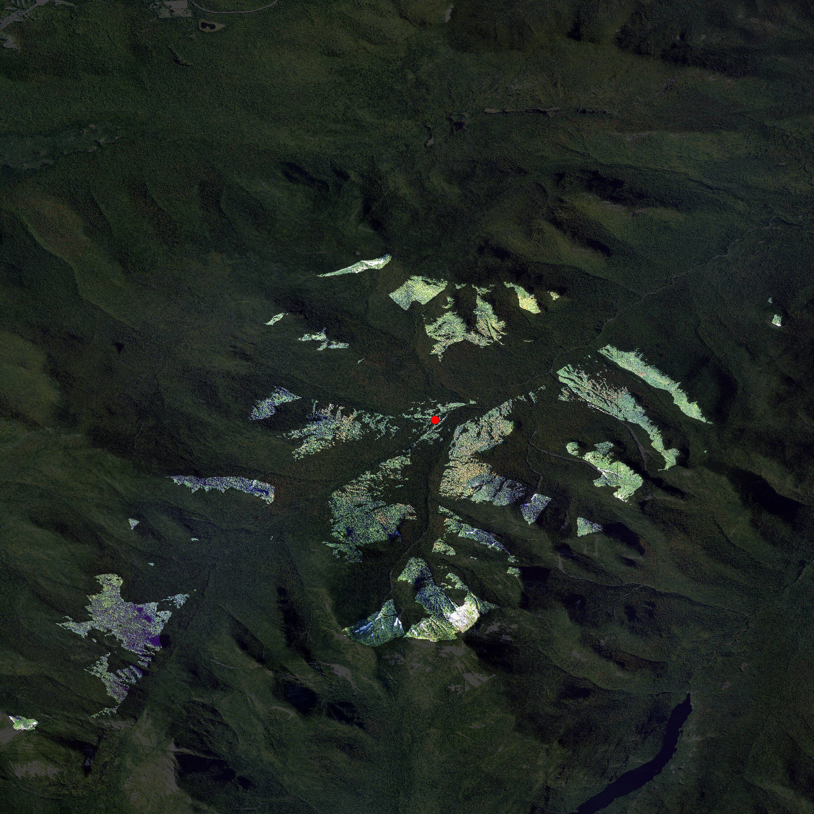
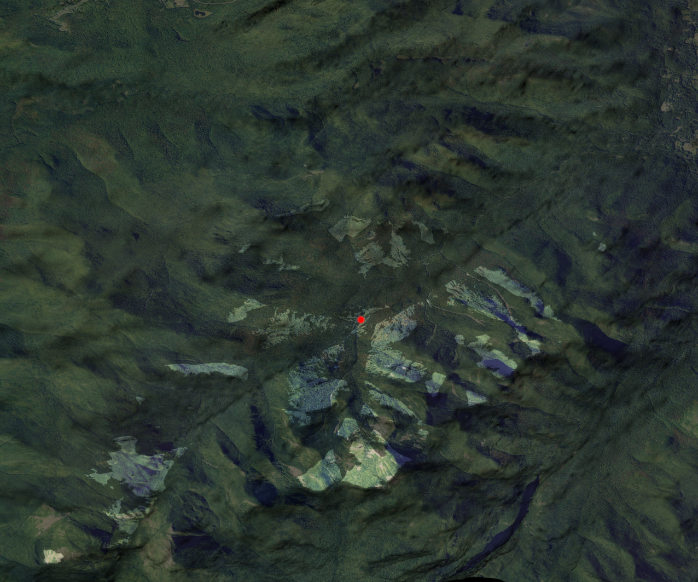
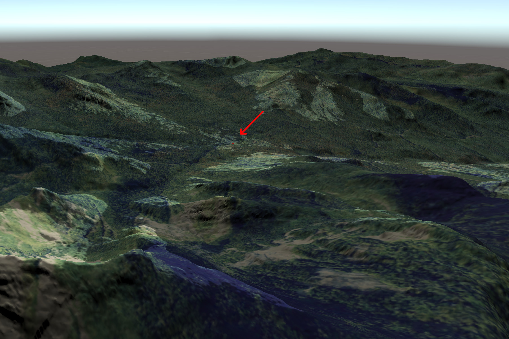

# Interactive landscape simulations for visual resource assessment

Code and files for the paper "Interactive landscape simulations for visual resource assessment", presented at the [2021 Visual Resources Stewardship Conference](https://sites.google.com/usu.edu/vrsconf03).

## Overview

High-resolution 3D renderings are extremely useful for communicating spatial data, allowing users to place themselves into the environment and use their intuition about how an area "should" look to aid in interpreting the data. Producing these renderings can be difficult, however, due to the demanding computational and technical requirements of creating detailed renderings in traditional GIS software. In this paper, we discuss the use of game engines as GIS, taking advantage of their highly performant rendering engines as a way to produce scientific visualizations. 

By walking through an example viewshed analysis, we demonstrate that game engines may be used to produce similar visualizations to traditional GIS softwares:

_Johns Brook Lodge, in red, against orthoimagery, made using QGIS._

_Johns Brook Lodge, in red, against orthoimagery, made using the Unity 3D game engine._

And show how these interactive, high-resolution surfaces may aid in interpreting and evaluating model outputs.

_A different angle of the viewshed surface in the Unity 3D engine, with the Johns Brook Lodge point highlighted by an arrow._

The paper can be found at [vrs_2021.pdf](vrs_2021.pdf), was written in [vrs_paper.Rmd](vrs_paper.Rmd), and all the code required is in [vrs_code.R](vrs_code.R).
