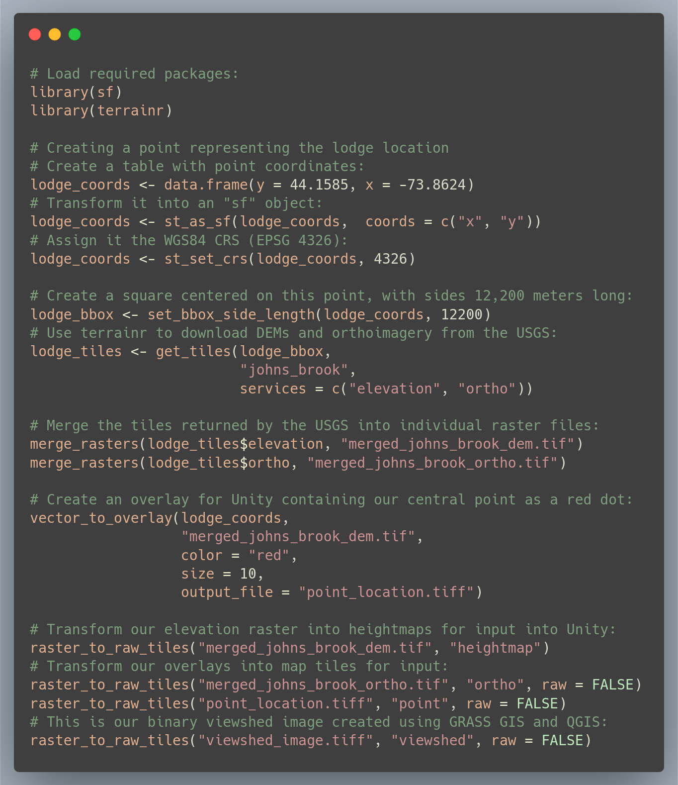

```{r setup, include=FALSE}
knitr::opts_chunk$set(echo = FALSE)
```

# Introduction

Environmental decision making is a complex process, requiring 
stakeholders of varying educational and professional backgrounds to communicate 
and negotiate about differing environmental value systems to determine a 
mutually-agreeable course of action [@Metze2020]. One of the key challenges in 
this process 
is the translation of background knowledge and expertise between stakeholders, 
particularly as members of the public become increasingly involved in making 
decisions about landscape management. For this reason, visualizations have often 
been described as a "common language" which may help stakeholders understand one 
another more effectively, allowing stakeholder values, background knowledge, and
statistical information to be communicated in a more intuitively understandable 
format [@Nicholson2005]. In particular, interactive visualizations may allow 
stakeholders with less formal training more agency to explore data and 
modeled outcomes on their own, potentially identifying preferred alternatives or 
problematic assumptions baked into the presented analysis. To this end, 
interactive simulations have been used
for engaging the public to great effect in domains such as transportation 
policy [@Lovelace2020] and urban planning [@Pettit2015].

However, many environmental problems don't lend themselves to the types of 
interactive graphics that have flourished elsewhere While some metrics
may be easily plotted, others (such as visual impact, ecological integrity, or 
land management histories) require more context than can be communicated through
standard visualizations. While interactive 2D maps are able to provide some 
spatial context to data, they often still require users to think about a 
landscape in a highly abstract way, attempting to match colors on a map to 
regions of a color key located elsewhere, match symbols to values in a legend 
(or to values implicitly assumed to be understood), and to convert pixel 
distances and areas into their real world equivalents. This level of abstraction
can make maps rather difficult to understand, limiting their value as a 
translational tool [@Ottosson1988].

This limitation may be overcome by creating more true-to-life renderings of an 
area of interest, visualizing landscapes more similarly to how they might appear
in the real world. This practice is already prevalent in visual resources 
management, with realistic renderings of proposed management activity a common
stage in many decision making processes [@Molina2011; @Szumilas2019].
These visualizations are more effective when produced at higher resolutions, 
with increased realism and visual fidelity [@Appleton2003]; however, producing 
these highly realistic renderings typically requires more computational power 
and technical knowledge than more abstract 2D maps [@Paar2006].

Game engines have been proposed as a potential solution for the demanding 
requirements of producing these renderings [@Herwig2002]. These programs, 
specifically tuned to render terrain at high resolutions quickly 
enough so that players in a video game won't notice any computation lag, can 
simulate large-scale landscapes using mass market computer equipment. The most 
popular of these engines, the Unity real-time development 
platform [@Unity], has been used to produce 3D landscape visualizations since 
at least 2010 [@Wang2010]. However, while Unity solves many of the computational 
obstacles to the use of large-scale 3D renderings, it still demands a high 
level of skill and familiarity for users to produce landscape visualizations.
Perhaps for this reason, Unity is still under-utilized as a tool for 3D 
landscape visualization.

This paper describes the `terrainr` package [@terrainr], an extension for the
open source R programming language [@R] which assists users in retrieving, 
manipulating, and transforming spatial data for importing to Unity, and 
illustrates how this package may be used as part of a workflow for visualizing 
visual impacts and viewsheds. By depicting landscapes in a more concrete form 
than typical 2D maps, this workflow produces renderings that may be more 
intuitively understandable for a generalist audience, serving as an effective 
tool for translating between stakeholders in an environmental decision making 
process.

# Viewshed Analyses with `terrainr`

To illustrate the potential of high-resolution 3D simulations for visual 
resources management, we will walk through an example viewshed analysis using 
both traditional 2D mapping and Unity. As an example, we will examine the 
viewshed impacted by the Johns Brook Lodge building, a privately operated resort
located within the Eastern High Peaks wilderness area of the Adirondack State 
Park. All code required to reproduce this section is included as Figure 1; we 
will not focus on defining functions and parameters here but rather defer to the 
documentation provided with the `sf` and `terrainr` packages [@sf; @terrainr].

```{r code_required, out.width='100%', fig.cap="All the R code required for the visualizations incorporated in this paper. In addition, viewshed calculation was done using GRASS GIS version 7.8, with the outputs saved as an image using QGIS. Descriptions of functions and their arguments is available online at https://docs.ropensci.org/terrainr/"}

```

The initial step in this process is to define our area of interest. We first 
define a point located at Johns Brook Lodge (44.1585$^{\circ}$ N, 
73.8624$^{\circ}$ W), then convert it into a "simple features" object using the 
WGS 1984 coordinate reference system (EPSG code 4326) using functions provided 
by the `sf` package [@sf]. Next, we use functions from `terrainr` to define a 
bounding box centered on the lodge, with side lengths of 12,200 meters. We then
are able to use this bounding box to download a bare earth digital elevation 
model (DEM) and orthoimagery from the USGS National Map [@TNM]. As the USGS
National Map is not able to return rasters representing our full bounding box
in a single query, the `get_tiles` function returns our data as a set of 
multiple map tiles, which we are then able to merge into cohesive individual 
rasters using the `merge_rasters` function. With approximately ten lines of 
code, we are able to define our area of interest, retrieve public domain data
for this area, and process the downloaded data into singular files which are 
easier to work with than separate tiles.

Unfortunately, identifying viewsheds cannot be implemented so easily. For this
process, we instead turn to the GRASS GIS function `r.viewshed`, run 
interactively through the QGIS interface [@GRASS_GIS_software; QGIS_software].
By instructing the program to produce a boolean raster, indicating only whether
a given pixel is or is not able to see the lodge, we produce the viewshed map 
presented as Figure 2. By changing the default symbology of the map such that 
the viewsheds are entirely transparent, and the other areas a slightly 
transparent black, we can overlay this raster upon orthoimagery to produce a 
more contextualized map; this is presented as Figure 3.

```{r boolean_viewshed, out.width='100%', fig.cap="A map showing the visibility of the Johns Brook Lodge (red dot), produced in QGIS. Yellow polygons are able to see the lodge, while purple regions cannot."}

```


```{r ortho_viewshed, out.width='100%', fig.cap="A map showing the visibility of the Johns Brook Lodge (red dot), produced in QGIS. Brighter regions are able to see the lodge, while shaded areas cannot."}
knitr::include_graphics("images/ortho_viewshed.jpg")
```

At this point, we save our re-symbolized raster as an image and return to R to
produce our 3D visualization. In our final lines of code, we produce an 
additional raster image containing a red dot at our lodge, and then produce map
tiles which may be imported into Unity through repeated use of the 
`raster_to_raw_tiles` function. By importing these tiles into Unity, a process 
documented by the "Importing terrainr tiles into Unity" vignette included with 
the package, we are able to quickly produce a 3D replica of this visualization
inside the game engine. When viewed isometrically from above (Figure 4), this 
rendering is incredibly similar to Figure 3; the only obvious evidence this is a 
different image is the smaller marker indicating the lodge.

```{r, out.width='100%', fig.cap="A map showing the visibility of the Johns Brook Lodge (red dot), produced using the Unity rendering engine. Brighter regions are able to see the lodge, while shaded areas cannot."}
knitr::include_graphics("images/above.jpg")
```

Of course, users are not restricted to viewing their landscape as a flat surface
from above. By moving the camera throughout the scene, users are able to 
investigate how viewsheds interact with terrain and features in orthoimagery 
(Figure 5; Figure 6). This control allows for a new depth of interactivity with
the visualization of model outputs; for instance, a user might validate the 
results of the viewshed operation by placing themselves at the feature of 
interest and searching for shaded regions (Figure 7). In total, this interactive
3D model allows users a greater degree of autonomy when exploring model results
and provides additional context not present in the 2D map incorporating the same
data.

```{r closer, fig.cap="A map showing the visibility of the Johns Brook Lodge (red dot), produced using the Unity rendering engine. Brighter regions are able to see the lodge, while shaded areas cannot. This image is taken facing towards the southwest, so that Mt. Marcy is approximately centered in the horizon. Users are able to manipulate the camera to reposition themselves throughout this scene and investigate model outputs in various regions."}
knitr::include_graphics("images/closer.jpg")
```

```{r further, fig.cap="A map showing the visibility of the Johns Brook Lodge (red dot), produced using the Unity rendering engine. Brighter regions are able to see the lodge, while shaded areas cannot. This image is taken from Algonquin Peak facing east towards Giant Mountain. Users are able to manipulate the camera to reposition themselves throughout this scene and investigate model outputs in various regions."}

```

```{r centered, out.width='100%', fig.cap="A map showing the visibility of the Johns Brook Lodge (red dot), produced using the Unity rendering engine. This image, taken from the location of the lodge itself, is entirely highlighted, allowing users to verify that the viewshed algorithm has correctly identified areas which may be seen from the lodge."}
knitr::include_graphics("images/centered.jpg")
```

# Discussion

Interactive visualizations present an exciting opportunity for engaging 
stakeholders in environmental decision making processes, helping nonspecialist
participants investigate data and models through friendlier interfaces than 
those used by the professional analyst or researcher. In particular, 
high-resolution landscape visualizations are particularly well suited for 
communicating many classes of environmental data, given the importance of 
spatial context to the interpretation of data and results. By making it easier
to produce these visualizations, the `terrainr` package aims to make this tool
more viable for land managers and environmental practitioners to incorporate 
into their decision making and outreach processes.

These 3D simulations are capable of effectively reproducing the outputs from 
traditional GIS-based analyses (Figure 3, Figure 4), but then allow users the 
freedom to explore the presented results in order to develop questions and draw
their own conclusions about the performed analysis. This freedom may be 
useful when seeking to engage external stakeholders in a decision making 
process, as the interactivity allows users to surface and focus upon oddities 
and assumptions in the presented results which may have been masked in static
visuals. By the same token, however, these visualizations are inherently less 
directed than static graphics or pre-developed video renditions, which may make 
it harder to present arguments and persuade an audience through this medium. 
Whether this is a benefit or a limitation of the approach is inherently 
dependent upon the goals of any particular visualization project, as well as 
one's beliefs about the roles of researchers and other stakeholders in 
interpreting results and coming to decisions.

The visualizations presented in this paper have purposefully been restricted to
those which may be programmatically generated using only `terrainr` and other 
publicly available open-source software products, without requiring a large 
degree of manual design or manipulation to produce. However, the Unity engine is 
capable of displaying hundreds or thousands of objects on top of these terrain 
layers for more realistic simulations. This allows users to place, for example,
purchased models of trees at strategic points throughout the landscape to 
present the look and feel of a setting more realistically, or to place models of 
wind turbines to demonstrate the expected impact of a development project. There
does not exist at this time a way to programmatically develop objects for these
renderings in the way `terrainr` aids in the development of terrain tiles; this 
gap presents a clear direction for future work in this arena.

# Conclusion

Effective visualizations can serve as a critical "translation layer" for 
environmental decision making, aiding in the communication of information and 
value systems between stakeholders of different educational and professional 
backgrounds. The increasing importance of public involvement in decision making
processes has driven an increase in interactive visualizations, which may allow
nonspecialists greater agency in investigating data and models and identifying 
alternative solutions. To this end, this paper has presented a new method for 
producing interactive 3D landscape visualizations, including a demonstration of 
how the method might be applied to viewshed analyses. This method allows users
to explore and validate presented results, and provides these results with more
spatial context than most traditional 2D mapping approaches. If combined with 
manual placement of objects such as trees, buildings, or wind turbines, this 
class of visualization presents an exciting opportunity for many aspects of 
visual resources management.

\newpage{}

# References {#references .unnumbered}