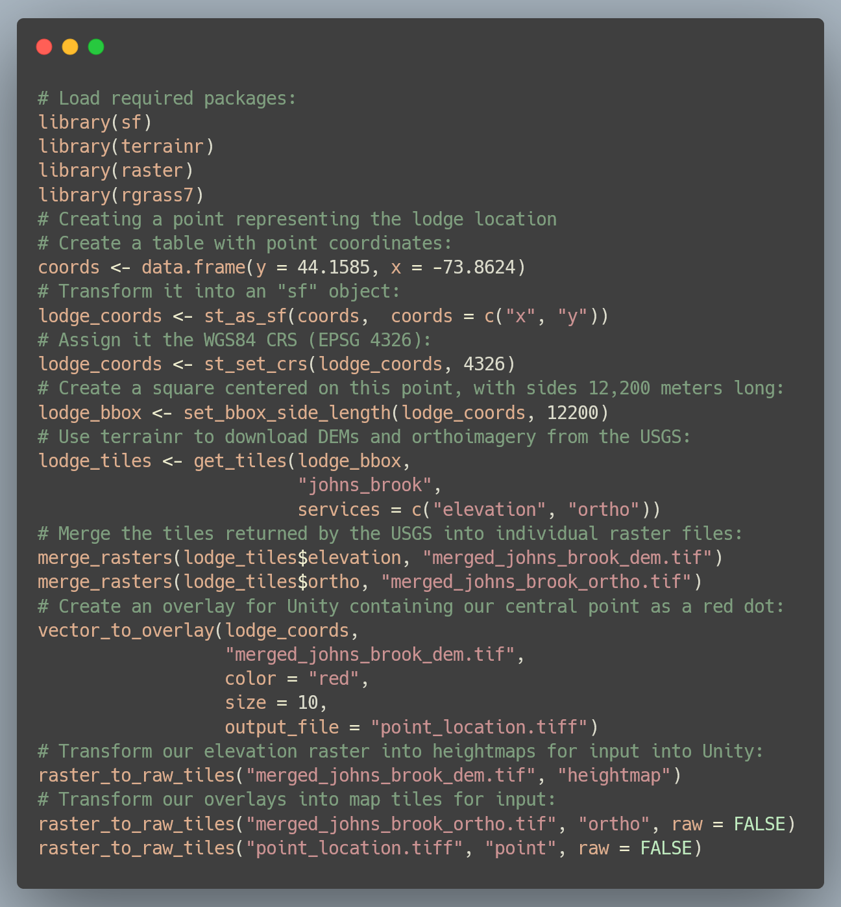
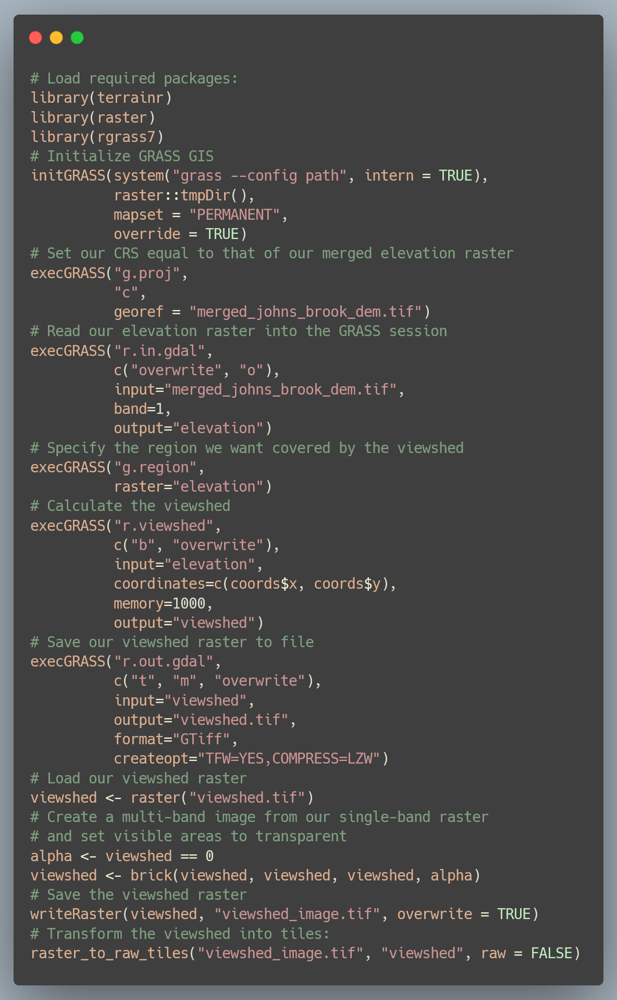

```{r setup, include=FALSE}
knitr::opts_chunk$set(echo = FALSE)
```

# Introduction

Environmental decision making is a complex process, requiring 
stakeholders of varying educational and professional backgrounds to communicate 
and negotiate about differing environmental value systems to come to a 
mutually-agreeable course of action [@Metze2020]. One of the key challenges in 
this process 
is the translation of background knowledge and expertise between stakeholders, 
particularly as members of the public become increasingly involved in making 
decisions about landscape management. For this reason, visualizations have often 
been described as a "common language" which may help stakeholders understand one 
another more effectively, allowing stakeholder values, background knowledge, and
statistical information to be communicated in a more intuitively understandable 
format [@Nicholson2005]. In particular, interactive visualizations may allow 
stakeholders with less formal training more agency to explore data and 
modeled outcomes on their own, potentially identifying preferred alternatives or 
problematic assumptions baked into the presented analysis. To this end, 
interactive simulations have been used
for engaging the public to great effect in domains such as transportation 
policy [@Lovelace2020] and urban planning [@Pettit2015].

However, many environmental problems do not lend themselves to the types of 
interactive graphics that have flourished in other domains Although some 
environmental metrics (such as
temperature or precipitation) lend themselves naturally to familiar line or bar
plots, others (such as visual impact, ecological integrity, or 
land management histories) often require more context to properly interpret than 
can be provided through standard visualizations. While 2D maps are able to 
provide spatial context to data, these visualizations often still require users 
to think about a landscape in a highly abstract way, attempting to match colors 
on a map to regions of a color key, match symbols to values in 
a legend (or to values implicitly assumed to be understood), and to convert pixel 
distances and areas into their real world equivalents. Such levels of abstraction
can make maps rather difficult to understand and correctly interpret, limiting 
their value as translational tools [@Ottosson1988].

This limitation may be overcome by creating more true-to-life renderings of an 
area of interest, visualizing landscapes more similarly to how they might appear
in the real world. By using realistic representations of features of interest,
these renderings may allow users to apply their intuition about how areas
"should" look and function more intuitively than might be possible with more 
abstract representations. For this 
reason, this practice is already prevalent in visual resources 
management, with realistic renderings of proposed management activity a common
stage in many decision making processes [@Molina2011; @Szumilas2019].
These visualizations are more effective when produced at higher resolutions, 
with increased realism and visual fidelity [@Appleton2003]; however, producing 
such highly realistic renderings typically requires more computational power 
and technical knowledge than more abstract 2D maps [@Paar2006].

Game engines have been proposed as a potential solution for the demanding 
requirements of producing these renderings [@Herwig2002]. These programs, 
specifically tuned to render terrain at high resolutions quickly 
enough so that players in a video game do not experience any computational lag, 
can simulate large-scale landscapes using mass market computer equipment. The 
most popular of these engines, the Unity real-time development 
platform [@Unity], has been used to produce 3D landscape visualizations since 
at least 2010 [@Wang2010]. However, while Unity solves many of the computational 
obstacles to the creation of large-scale 3D renderings, it still demands a high 
level of technical skill. Perhaps for this reason, Unity is still under-utilized 
as a tool for landscape visualization.

This paper describes the terrainr package [@terrainr], an extension for the
open source R programming language [@R] which assists users in retrieving, 
manipulating, and transforming spatial data to import into Unity, and 
illustrates how this package may be used as part of a workflow for visualizing 
visual impacts and viewsheds. By depicting landscapes in a more concrete form 
than typical 2D maps, this workflow produces renderings that may be more 
intuitively understandable for a generalist audience, serving as an effective 
tool for translating between stakeholders in an environmental decision making 
process.

# Viewshed Analyses with terrainr

To illustrate the potential of high-resolution 3D simulations for visual 
resources management, we will walk through an example viewshed analysis using 
both traditional 2D mapping and Unity. As an example, we will examine the 
viewsheds (that is, the regions which are visible from a given location) 
impacted by the Johns Brook Lodge building, a privately operated resort
located within the eastern High Peaks Wilderness Area of the Adirondack State 
Park. All code required to produce these graphics is included as Figure 1, with 
code required for calculating viewsheds included as Figure 2; we 
will not focus on defining functions and parameters here but rather defer to the 
documentation provided with the sf and terrainr packages and GRASS GIS 
[@sf; @terrainr; @GRASS_GIS_software].

```{r code_required, out.width='100%', fig.cap="R code required for creating the visualizations in this paper. Descriptions of functions and their arguments are available online at https://docs.ropensci.org/terrainr/"}

```

The initial step in this process is to define our area of interest. We first 
define a point located at Johns Brook Lodge (44.1585$^{\circ}$ N, 
73.8624$^{\circ}$ W), then convert it into a "simple features" object using the 
WGS 1984 coordinate reference system (EPSG code 4326) using functions provided 
by the sf package [@sf]. Next, we use functions from terrainr to define a 
bounding box centered on the lodge, with side lengths of 12,200 meters. We then
are able to use this bounding box to download a bare earth digital elevation 
model (DEM) and orthoimagery from the USGS National Map [@TNM]. As the USGS
National Map is not able to return rasters representing our full bounding box
in a single query, the "get_tiles" function returns our data as a set of 
multiple map tiles, which we then must merge into cohesive individual 
rasters using the "merge_rasters" function. All told, this process of
defining our area of interest, retrieving public domain data
for this area, and processing the downloaded data into singular files requires
approximately ten lines of code. We then produce map tiles for import into Unity,
a process documented in the "Importing terrainr tiles into Unity" vignette 
included with the terrainr package, through repeated use of the 
"raster_to_raw_tiles" function.

With our elevation and orthoimagery prepared and ready for import into Unity, we 
can now turn our attention to performing a viewshed analysis. For this analysis,
we calculated viewsheds using the GRASS GIS function "r.viewshed", run 
using thergrass7" R package [@GRASS_GIS_software; @Bivand2021]. The code 
required to produce a viewshed raster is included as Figure 2.

```{r viewshed_code, out.width='100%', fig.cap='R code required for implementing the viewshed analysis performed in this paper, using GRASS GIS version 7.8. The coords" object is created in the code from Figure 1. Descriptions of functions and their arguments are available online at https://grass.osgeo.org/'}

```

By instructing the program to produce a boolean raster, indicating only whether
a given pixel is or is not able to be seen from the lodge, we produce the 
viewshed map presented as Figure 3. By changing the default coloration of the map 
such that the viewsheds are entirely transparent, and all other areas a slightly 
transparent black, we can overlay this raster upon orthoimagery to produce a 
map that provides additional spatial context; this is presented as Figure 4.

```{r boolean_viewshed, out.width='100%', fig.cap="A map showing the visibility of the Johns Brook Lodge (red dot). Yellow areas are able to see the lodge, while purple regions cannot."}
knitr::include_graphics("images/boolean_viewshed.png")
```

```{r ortho_viewshed, out.width='100%', fig.cap="A map showing the visibility of the Johns Brook Lodge (red dot). Brighter regions are able to see the lodge, while shaded areas cannot."}
knitr::include_graphics("images/ortho_viewshed.jpg")
```

In total, producing these viewshed rasters requires approximately 30 lines of 
code (Figure 2). The combination of this code with the script used for data 
retrieval and processing (Figure 1) enables a completely reproducible workflow
for viewshed analysis, with all steps of the analysis pipeline captured as code
that can be run or validated by other collaborators. Another advantage of this 
approach is that we may recreate this analysis for any location within the United
States simply by changing our initial latitude and longitude stored in the 
"coords" object; while writing this program may take longer than using a 
graphical user interface for a single viewshed analysis, the time
saved by automation can become significant when calculating multiple viewsheds.
Finally, this analysis uses only freely available open-source software which may 
be downloaded and installed by anyone with internet access, as well as data from 
the public domain which has no restriction on its use.

We have so far focused our attention on using terrainr within R as a method for
reproducible viewshed analyses. For users looking to visualize the outputs of 
these calculations, terrainr additionally provides methods (via the 
"raster_to_raw_tiles" function in Figures 1 and 2) for transforming data into 
tiles which may be imported into the Unity 3D rendering engine. By importing 
these tiles into Unity, a process documented in the "Importing terrainr tiles 
into Unity" vignette included with the terrainr package, we are able to quickly 
produce a 3D replica of our viewshed visualization. When viewed isometrically 
from above (Figure 5), this rendering is incredibly similar to Figure 4; the 
only obvious evidence this is a different image are some slight differences in 
hue and the smaller marker indicating the lodge.

```{r, out.width='100%', fig.cap="A map showing the visibility of the Johns Brook Lodge (red dot), produced using the Unity rendering engine. Brighter regions are able to see the lodge, while shaded areas cannot."}
knitr::include_graphics("images/above.jpg")
```

One of the chief benefits of this 3D rendition, however, is that
users are no longer restricted to viewing their landscape as a flat surface
from above. By moving the camera throughout the scene, users are able to 
investigate how viewsheds interact with terrain and features in orthoimagery 
(Figure 6; Figure 7). This control allows for a new depth of interactivity with
the visualization of model outputs; for instance, a user might validate the 
results of the viewshed operation by placing themselves at the feature of 
interest and searching for shaded regions (Figure 8). In total, this interactive
3D model allows users a greater degree of autonomy when exploring model results
and provides additional context not present in the 2D map incorporating the same
data.

```{r closer, fig.cap="A map showing the visibility of the Johns Brook Lodge (red dot, with an arrow to highlight), produced using the Unity rendering engine. Brighter regions are able to see the lodge, while shaded areas cannot. This image is taken facing towards the southwest, so that Mt. Marcy is approximately centered in the horizon. Users are able to manipulate the camera to reposition themselves throughout this scene and investigate model outputs in various regions."}
knitr::include_graphics("images/closer_arrow.jpg")
```

```{r further, fig.cap="A map showing the visibility of the Johns Brook Lodge (red dot, with an arrow to highlight), produced using the Unity rendering engine. Brighter regions are able to see the lodge, while shaded areas cannot. This image is taken from Algonquin Peak facing east towards Giant Mountain. Users are able to manipulate the camera to reposition themselves throughout this scene and investigate model outputs in various regions."}
knitr::include_graphics("images/further_arrow.jpg")
```

```{r centered, out.width='100%', fig.cap="A map showing the visibility of the Johns Brook Lodge (red dot), produced using the Unity rendering engine. This image, taken facing south from the location of the lodge itself, is entirely highlighted, allowing users to verify that the viewshed algorithm has correctly identified areas which may be seen from the lodge."}
knitr::include_graphics("images/centered.jpg")
```

# Discussion

Interactive visualizations present an exciting opportunity for engaging 
nonspecialist participants in environmental decision making processes, helping
stakeholders investigate data and models in a more intuitive fashion than the
the data analysis programs used by the professional analyst or researcher provides. 
In particular, high-resolution interactive landscape visualizations are 
particularly well suited for communicating many classes of environmental data, 
given the importance of spatial context to the interpretation of data and results. 
Through its set of data retrieval and processing functions, the terrainr 
package aims to make producing such visuals faster, easier, and more reproducibly
for land managers and researchers so that these visualizations may be 
incorporated into decision making and outreach programs.

These 3D simulations are capable of effectively reproducing the outputs from 
traditional GIS-based analyses (Figure 3, Figure 4), and additionally allow 
users the freedom to explore the presented results in order to develop questions 
and draw their own conclusions about the performed analysis. This freedom may be 
useful when seeking to engage external stakeholders in a decision making 
process, as the interactivity allows users to surface and focus on oddities 
and assumptions in results which may have been masked by static
visuals. By the same token, however, these visualizations are inherently less 
directed than static graphics or pre-developed videos of renderings, which may 
make it harder to use these tools to advance an argument or persuade an 
audience. Whether this is a benefit or a limitation of the approach will
inherently depend upon the goals of a particular visualization project, as 
well as one's beliefs about the roles of researchers and other stakeholders in 
interpreting results and reaching decisions.

The visualizations presented in this paper have purposefully been restricted 
so that data processing could be performed programmatically using only 
terrainr and other publicly available open-source software products, without 
requiring a large degree of manual design or manipulation to produce. However, 
the Unity engine is capable of displaying hundreds or thousands of objects on 
top of these terrain layers for more realistic simulations. This allows users to 
place, for example, purchased models of trees at strategic points throughout the 
landscape to more accurately capture the aesthetic and feeling of a setting, or 
to place models of wind turbines or buildings to demonstrate the expected impact 
of a development project. There does not exist at this time a way to 
programmatically develop objects for these renderings in the way terrainr aids 
in the development of terrain tiles, and as such this currently would require 
users to be more familiar with Unity than is needed for producing landscape 
visualizations; this gap presents a clear direction for future work.

# Conclusion

Effective visualizations can serve as a critical "translation layer" for 
environmental decision making, aiding in the communication of information and 
value systems between stakeholders of different educational and professional 
backgrounds. The increasing importance of public involvement in decision making
processes has driven an increase in the use of interactive visualizations, which 
may allow nonspecialists greater agency in investigating data and models and 
identifying alternative solutions. To this end, this paper has presented a new 
method for producing interactive 3D landscape visualizations, including a 
demonstration of how the method might be applied to viewshed analyses. This 
method allows users to explore and validate presented results, and provides 
these results with more spatial context than most traditional 2D mapping 
approaches. Particularly if combined with manual placement of objects such as 
trees, buildings, or wind turbines, this class of visualization presents an 
exciting opportunity for many aspects of visual resources management.

\newpage{}

# References {#references .unnumbered}